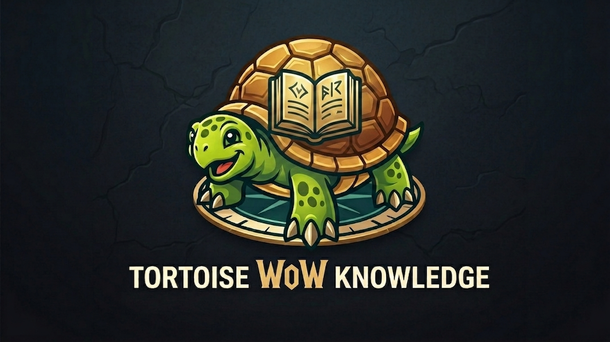

| Metadata | Value |
| --- | --- |
| Type | Guide |
| Title | Tortoise WoW Knowledge |
| Description | Repository entry point for the deployment-agnostic offline-preservation Tortoise WoW knowledge bundle. |
| Tags | guide, repository |
| Status | stable |
| Sources | [Original Tortoise WoW repository](https://github.com/Penqle/tortoise-wow), [Tortoise WoW PlayerBots fork](https://github.com/Shyalya/tortoise-wow) |

## Purpose

This repository is an independent, non-commercial offline preservation and technical knowledge project. Its purpose is to preserve the knowledge required to understand, build, and run the referenced open-source server software locally for archival, research, and personal experimentation.

It does not operate, host, or provide access to a public game server. It is not intended for monetization or as a live service, and it is not affiliated with or endorsed by any upstream project, publisher, or rights holder.

A deployment-agnostic knowledge bundle for operating and modifying a solo Turtle WoW 1.18.1 server with the Tortoise core and PlayerBots.

All PlayerBots documentation is source-pinned to the PlayerBots-enabled fork [Shyalya/tortoise-wow](https://github.com/Shyalya/tortoise-wow). The base [Penqle/tortoise-wow](https://github.com/Penqle/tortoise-wow) core ships no playerbots logic; its tree still carries legacy playerbots remnants that Penqle PR [#396 `cleanup/remove-playerbots`](https://github.com/Penqle/tortoise-wow/pull/396) (open, 2026-08-19) removes.

Start with:

- [Agent guide](AGENTS.md) for task routing and safety boundaries
- [Knowledge index](index.md) for the complete topic listing
- [PlayerBots capability map](playerbots/capability-map.md) for source-pinned bot behavior and commands

The bundle intentionally excludes hostnames, endpoints, SSH aliases, accounts, credentials, character names, live settings, and other deployment-specific values. Supply those through a separately protected private deployment record when performing operational work.

## Credits

This knowledge bundle is based on the work of:

- [Penqle/tortoise-wow](https://github.com/Penqle/tortoise-wow) — the original Tortoise WoW project.
- [Shyalya/tortoise-wow](https://github.com/Shyalya/tortoise-wow) — the PlayerBots-enabled fork used for the source-pinned behavior and command documentation in this bundle.

All credit for the server implementation belongs to the respective upstream authors and contributors. This repository is an independent documentation project and is not an official upstream repository.
